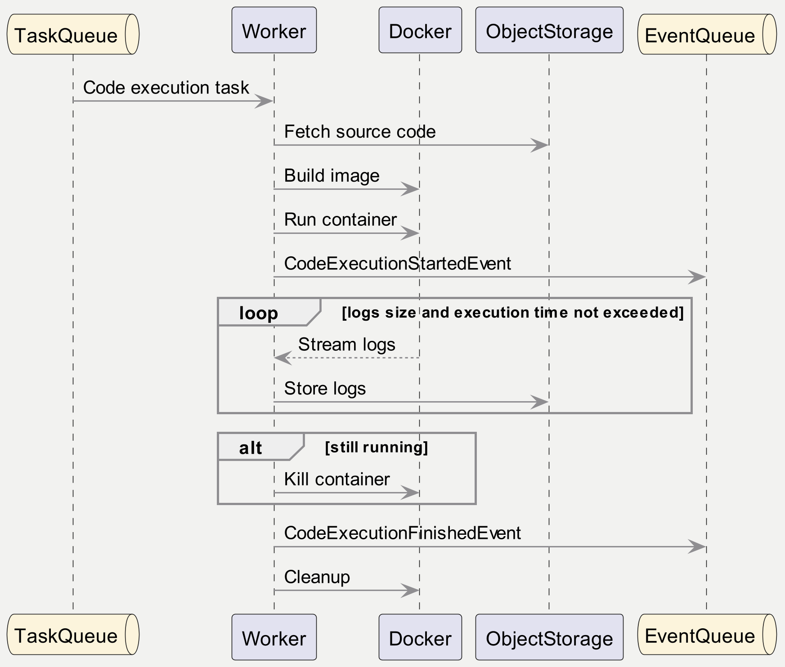

### Components
- **Server**. 
Provides REST API for code execution management (creating code execution, checking its status, observing results, etc.).
Delegates the actual execution to workers.
- **Worker**. 
Responsible for compiling and running code. Makes sure that the results of code execution available.
- **Container**. 
Used to isolate actual code execution.
- **Object Storage**.
Stores the source code and execution results.
- **Database**. 
Stores domain entities (CodeExecution, etc.).
- **Task Queue** and **Event Queue**.
Used for communication between Server and Workers.

### Technologies
- **Kotlin** (for writing *Server* and *Worker* component's code)
- **Kotlin Coroutines** (for managing concurrency on application level)
- **Ktor** (for REST API implementation)
- **Koin** (for dependency injection)
- **JUnit 5 and MockK** (tests)
- **Exposed** (for SQL)
- **PostgreSQL** (*Database* component)
- **Amazon S3** (*Object Storage* component)
- **RabbitMQ** (*Task Queue* and *Event Queue* components)
- **Docker** (for running code and packaging the service itself)
- **Docker Compose** (for packaging all infrastructure together)

### Worker lifecycle

### Code execution
It is suggested to use [Docker Engine API](https://docs.docker.com/engine/api/v1.42) to build images with source code
and run it in containers. The choice of base image will depend on chosen platform. 
For example, in case of .NET it can be `mcr.microsoft.com/dotnet/sdk:6.0`.

### REST API
This is a high-level description of the API, so some details are omitted.
- *POST /code-execution*. 
Submits source code for its execution.
The request body contains *language*, *compiler* and *code* parameters.
Returns *id* of execution that can be used later to check its status and return results.
- *GET /code-execution/:id*.
Returns code execution status (*SUBMITTED*, *RUNNING*, *COMPLETED*, *FAILED*) and some other information.
- *GET /code-execution/:id/output*. 
Returns code execution output.
This API should return output for completed and not completed executions.
For the first iteration it is suggested to return the whole content
from stdout and stderr streams.
Then it can be improved in several ways.
  - We can use pagination (e.g. by adding *fromPage* request parameter and *nextPage*
    response field). 
  - stdout and stderr streams can be separated.
  - Exit code can be returned as separate response field.
  - We can try to parse the results (e.g. separate DEBUG/INFO/WARN/etc. output).
  - We can add possibility to get results from the end rather than from the beginning.