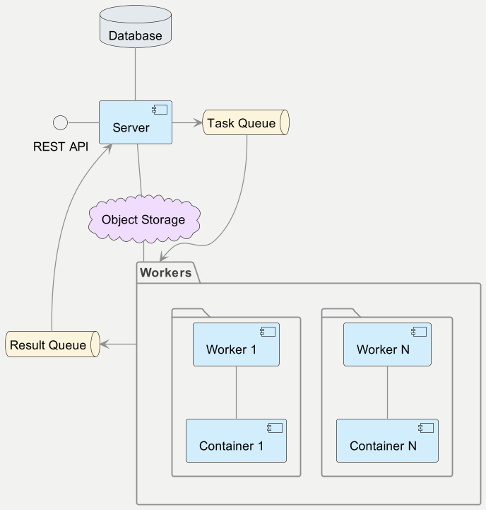
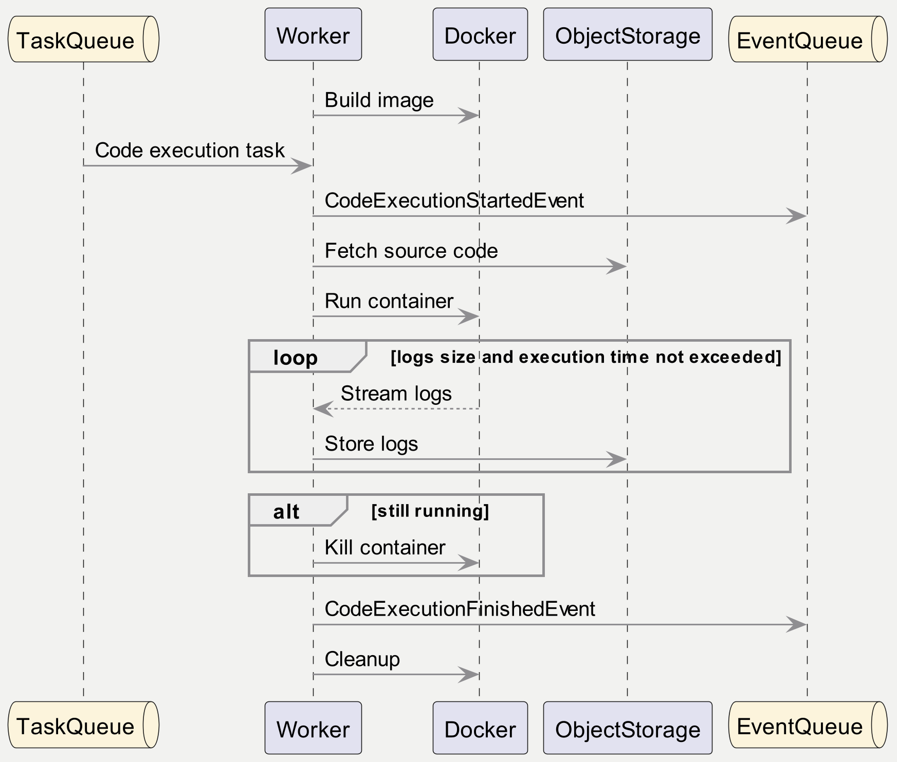

### Components
- **Server**. 
Provides REST API for code execution management (creating code execution, checking its status, observing results, etc.).
Delegates the actual execution to workers.
- **Worker**. 
Responsible for compiling and running code. Makes sure that the results of code execution available.
- **Container**. 
Used to isolate actual code execution.
- **Object Storage**.
Stores the source code and execution results.
- **Database**. 
Stores domain entities (CodeExecution, etc.).
- **Task Queue** and **Event Queue**.
Used for communication between Server and Workers.

### Worker lifecycle

### Code execution
[Docker Engine API](https://docs.docker.com/engine/api/v1.42) is used to build runner images
and managing containers. Currently only [Mono](https://www.mono-project.com/) runner is supported. However, adding new runners 
should not take a lot of effort given the current architecture.

### REST API
This is a high-level description of the API, so some details are omitted.
- `POST /code-execution`. 
Submits source code for its execution.
The request body contains `language`, `compiler` and `sourceCode` parameters.
Returns `id` of code execution that can be used later to check its status and return results.
- `GET /code-execution/{id}`.
Returns code execution status and some other information.
- `GET /code-execution/{id}/logs`. 
Returns code execution logs.
Current implementation returns all logs.
It can be improved in several ways.
  - Pagination (e.g. by adding `fromPage` request parameter and `nextPage`
    response field). 
  - Filter response by `stdout` and `stderr` streams.
  - More intelligent response parsing (e.g. detecting common compilation issues, etc.).
  - Tailing the results, filter by date.

### Technologies
- **Kotlin** (for writing *Server* and *Worker* component's code)
- **Kotlin Coroutines** (for managing concurrency on application level)
- **Ktor** (for REST API implementation)
- **Koin** (for dependency injection)
- **Kotest** (unit and functional tests)
- **MinIO** (*Object Storage* component)
- **RabbitMQ** (*Task Queue* and *Event Queue* components)
- **Docker** (for running code and packaging the service itself)
- **Docker Compose** (for packaging all infrastructure together)